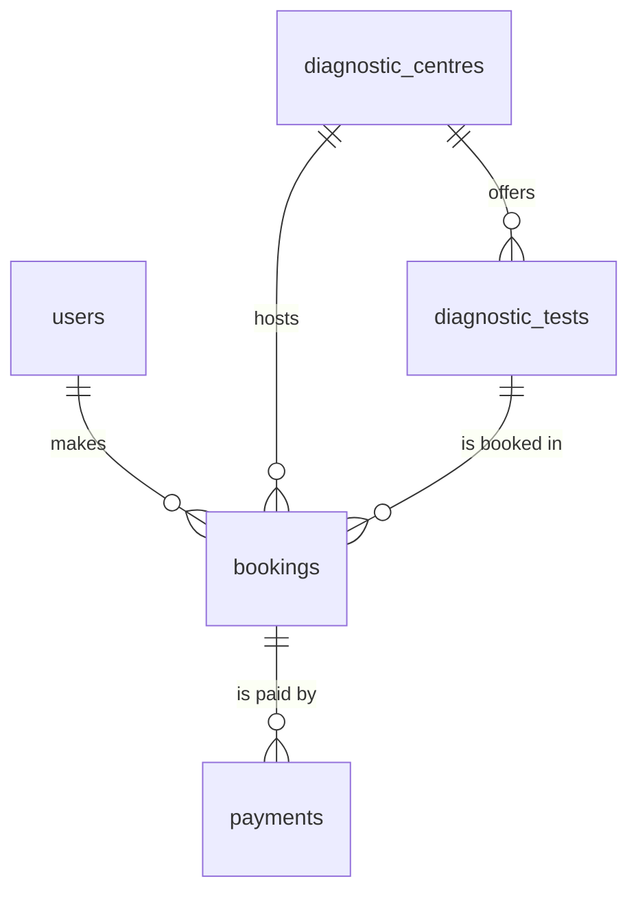

# EVE Healthcare - Diagnostic Test Booking API

A backend service for booking diagnostic tests at diagnostic centres, with a simulated payment service and an **idempotent payment webhook**.

Built for the EVE Healthcare SDE Intern backend assignment.

- **Runtime:** Node.js + TypeScript, Express 5
- **Database:** PostgreSQL, accessed with **raw SQL** through `pg` (no ORM)
- **Auth:** JWT (`jsonwebtoken`) with bcrypt-hashed passwords
- **Validation:** Zod
- **Docs:** OpenAPI 3 / Swagger UI at `/docs`
- **Logging:** structured JSON logs with pino
- **Tests:** Vitest + Supertest (unit tests and integration tests against a real Postgres)
- **Packaging:** pnpm, Docker, docker-compose

> This is a Node.js project, so dependencies are declared in `package.json` and locked in `pnpm-lock.yaml` (the equivalent of `requirements.txt` / `pyproject.toml`).

---

## Table of contents

1. [Project structure](#project-structure)
2. [Running locally](#running-locally)
3. [API endpoints](#api-endpoints)
4. [Database design](#database-design)
5. [How payments and the webhook work](#how-payments-and-the-webhook-work)
6. [Edge cases handled](#edge-cases-handled)
7. [Testing](#testing)
8. [Assumptions](#assumptions)
9. [What I would improve with more time](#what-i-would-improve-with-more-time)

---

## Project structure

The code is organised **by feature module**. Each module has the same layers, and only the repository layer contains SQL:

`routes -> controller -> service -> repository -> PostgreSQL`

```
src/
  app.ts                     Express app factory (used by the server and by tests)
  server.ts                  Entry point
  config/env.ts              Validated environment variables (fails fast on bad config)
  db/
    pool.ts                  pg connection pool
    transaction.ts           withTransaction() helper
    migrator.ts / migrate.ts Plain-SQL migration runner
    migrations/              001_init.sql, 002_payments_constraints.sql
  docs/openapi.ts            OpenAPI spec (+ test that keeps it consistent)
  middleware/                auth (JWT), validation, UUID params, error handler, HTTP logger
  modules/
    auth/                    signup, login
    centres/                 diagnostic centres and the tests they offer
    bookings/                create / get / list bookings
    payments/                simulated payment + idempotent webhook
  utils/                     AppError, jwt, password, logger, uuid helpers
tests/
  globalSetup.ts             Creates the test DB and runs migrations
  setup.ts                   Safety guard + table cleanup between tests
  helpers/api.ts             Test helpers (register user, create booking, ...)
  integration/               API-level tests against a real Postgres
```

---

## Running locally

### Prerequisites

- Docker + Docker Compose
- Node.js 20+ and pnpm (only needed to run the app or tests outside Docker; developed with Node 23 and pnpm 12, the Docker image uses Node 22)

### Option A - everything in Docker (fastest)

```bash
git clone https://github.com/<your-username>/eve-diagnostic-booking.git
cd eve-diagnostic-booking

cp .env.example .env
docker compose up --build
```

This starts PostgreSQL and the API. Migrations run automatically when the API container starts.

- API: http://localhost:3000
- Swagger UI: http://localhost:3000/docs
- Health check: http://localhost:3000/health

Stop with `docker compose down` (add `-v` to also delete the database volume).

### Option B - app on the host, Postgres in Docker (development)

```bash
cp .env.example .env
docker compose up -d postgres

pnpm install
pnpm migrate
pnpm dev
```

If pnpm reports "Ignored build scripts", run `pnpm approve-builds` and allow `bcrypt` and `esbuild`.

Do not run Option A and Option B at the same time; both use port 3000.

> Postgres is published on host port **5433** (not 5432) so it does not clash with a Postgres already installed on your machine. Inside the docker-compose network the API talks to `postgres:5432`. To change the host port, edit `docker-compose.yml` and `DATABASE_URL` / `TEST_DATABASE_URL` in `.env`.

### Environment variables

| Variable | Used by | Description | Default |
|---|---|---|---|
| `NODE_ENV` | app | `development`, `test` or `production` | `development` |
| `PORT` | app | HTTP port | `3000` |
| `POSTGRES_USER`, `POSTGRES_PASSWORD`, `POSTGRES_DB` | docker-compose | Credentials/database for the Postgres container | required |
| `DATABASE_URL` | app (host) | Connection string. Docker Compose overrides it with the internal `postgres:5432` address | required |
| `TEST_DATABASE_URL` | integration tests | Database name **must end with `_test`**; it is created automatically | required for integration tests |
| `JWT_SECRET` | app | Secret used to sign tokens (min. 10 characters) | required |
| `JWT_EXPIRES_IN` | app | Token lifetime, e.g. `1d` | `1d` |
| `PAYMENT_SUCCESS_RATE` | app | Probability (0 to 1) that a simulated payment succeeds. Use `1` to always succeed, `0` to always fail | `0.8` |
| `LOG_LEVEL` | app | pino log level | `info` (`silent` when `NODE_ENV=test`) |

The app validates these at startup and exits with a clear error if something is missing.

### Scripts

| Command | What it does |
|---|---|
| `pnpm dev` | Start the API with auto-reload |
| `pnpm start` | Start the API (used in Docker) |
| `pnpm migrate` | Apply pending SQL migrations |
| `pnpm test` | Unit tests, then integration tests |
| `pnpm test:unit` | Unit tests only (no database needed) |
| `pnpm test:integration` | Integration tests (needs Postgres running) |

---

## API endpoints

Interactive documentation with request/response schemas: **http://localhost:3000/docs** (raw spec at `/docs.json`).

| Method | Path | Auth | Description | Success | Error codes |
|---|---|---|---|---|---|
| GET | `/health` | - | Liveness check | 200 | - |
| POST | `/auth/signup` | - | Create an account, returns a JWT | 201 | 400, 409 |
| POST | `/auth/login` | - | Log in, returns a JWT | 200 | 400, 401 |
| POST | `/centres` | - | Create a diagnostic centre | 201 | 400 |
| GET | `/centres` | - | List centres | 200 | - |
| GET | `/centres/:id` | - | Get a centre with its tests | 200 | 400, 404 |
| POST | `/centres/:id/tests` | - | Add a test (with price) to a centre | 201 | 400, 404 |
| GET | `/centres/:id/tests` | - | List the tests a centre offers | 200 | 400, 404 |
| POST | `/bookings` | JWT | Book a test (status starts as `PENDING`) | 201 | 400, 401, 404 |
| GET | `/bookings` | JWT | List **your** bookings | 200 | 401 |
| GET | `/bookings/:id` | JWT | Get one of your bookings | 200 | 400, 401, 403, 404 |
| POST | `/payments` | JWT | Pay for a booking (simulated) | 201 | 400, 401, 403, 404, 409 |
| POST | `/payments/webhook` | - | Payment status update from the provider (idempotent) | 200 | 400, 404 |

All errors use the same shape:

```json
{ "error": "Booking not found" }
```

Validation errors (400) also include per-field messages:

```json
{ "error": "Validation failed", "details": { "email": ["Invalid email address"] } }
```

### Example requests

**Sign up / log in**

```bash
curl -X POST http://localhost:3000/auth/signup \
  -H "Content-Type: application/json" \
  -d '{"email":"test@example.com","password":"password123"}'
```

```json
{
  "user": { "id": "6736fea7-4616-403f-b282-3a4cbfb4450e", "email": "test@example.com" },
  "token": "eyJhbGciOiJIUzI1NiIs..."
}
```

```bash
curl -X POST http://localhost:3000/auth/login \
  -H "Content-Type: application/json" \
  -d '{"email":"test@example.com","password":"password123"}'
```

**Create a centre and add a test**

```bash
curl -X POST http://localhost:3000/centres \
  -H "Content-Type: application/json" \
  -d '{"name":"Apollo Diagnostics","location":"Bhubaneswar"}'

curl -X POST http://localhost:3000/centres/<centre_id>/tests \
  -H "Content-Type: application/json" \
  -d '{"name":"Complete Blood Count","price":499}'
```

```json
{
  "id": "d81a121e-75bf-4ed0-a85d-f2e8155db949",
  "centre_id": "2a3b5284-40d9-49cb-a8ef-64fc9d914806",
  "name": "Complete Blood Count",
  "price": "499.00"
}
```

**Browse**

```bash
curl http://localhost:3000/centres
curl http://localhost:3000/centres/<centre_id>          # centre + its tests
curl http://localhost:3000/centres/<centre_id>/tests
```

**Book a test** (requires `Authorization: Bearer <token>`)

```bash
curl -X POST http://localhost:3000/bookings \
  -H "Content-Type: application/json" \
  -H "Authorization: Bearer <token>" \
  -d '{"testId":"<test_id>","centreId":"<centre_id>","appointmentAt":"2030-01-15T10:00:00Z"}'
```

```json
{
  "id": "6d9ef797-72d2-436a-bd4b-549dcdb9119b",
  "user_id": "6736fea7-4616-403f-b282-3a4cbfb4450e",
  "test_id": "d81a121e-75bf-4ed0-a85d-f2e8155db949",
  "centre_id": "2a3b5284-40d9-49cb-a8ef-64fc9d914806",
  "appointment_at": "2030-01-15T10:00:00.000Z",
  "amount": "499.00",
  "status": "PENDING"
}
```

The `amount` always comes from the test's price on the server. Any amount sent by the client is ignored.

**Pay for a booking (simulated)**

```bash
curl -X POST http://localhost:3000/payments \
  -H "Content-Type: application/json" \
  -H "Authorization: Bearer <token>" \
  -d '{"bookingId":"<booking_id>"}'
```

```json
{
  "payment": { "id": "371daf86-...", "booking_id": "6d9ef797-...", "amount": "499.00", "status": "SUCCESS" },
  "booking": { "id": "6d9ef797-...", "status": "CONFIRMED" }
}
```

`SUCCESS` confirms the booking; `FAILED` marks it `FAILED`.

**Payment webhook** (sent by the payment provider, no JWT)

```bash
curl -X POST http://localhost:3000/payments/webhook \
  -H "Content-Type: application/json" \
  -d '{"eventId":"evt_1","paymentId":"<payment_id>","status":"SUCCESS"}'
```

```json
{ "result": "applied" }
```

| `result` | Meaning |
|---|---|
| `applied` | The payment/booking state was updated |
| `duplicate` | This `eventId` was already processed; nothing changed |
| `already_applied` | The payment already had this status |
| `ignored` | Transition not allowed (e.g. a `SUCCESS` payment never goes back to `FAILED`) or the booking is `CANCELLED` |

### End-to-end walkthrough (bash)

Set `PAYMENT_SUCCESS_RATE=0` in `.env` (and restart) to force a failed payment and see the webhook recover it.

```bash
getid() { grep -o '"id":"[^"]*"' | head -1 | cut -d'"' -f4; }

curl -s -X POST http://localhost:3000/auth/signup -H "Content-Type: application/json" \
  -d '{"email":"demo@example.com","password":"password123"}' > /dev/null

TOKEN=$(curl -s -X POST http://localhost:3000/auth/login -H "Content-Type: application/json" \
  -d '{"email":"demo@example.com","password":"password123"}' | grep -o '"token":"[^"]*"' | cut -d'"' -f4)

CENTRE_ID=$(curl -s -X POST http://localhost:3000/centres -H "Content-Type: application/json" \
  -d '{"name":"Apollo Diagnostics","location":"Bhubaneswar"}' | getid)

TEST_ID=$(curl -s -X POST http://localhost:3000/centres/$CENTRE_ID/tests -H "Content-Type: application/json" \
  -d '{"name":"Complete Blood Count","price":499}' | getid)

BOOKING_ID=$(curl -s -X POST http://localhost:3000/bookings -H "Content-Type: application/json" \
  -H "Authorization: Bearer $TOKEN" \
  -d "{\"testId\":\"$TEST_ID\",\"centreId\":\"$CENTRE_ID\",\"appointmentAt\":\"2030-01-15T10:00:00Z\"}" | getid)

PAYMENT_ID=$(curl -s -X POST http://localhost:3000/payments -H "Content-Type: application/json" \
  -H "Authorization: Bearer $TOKEN" -d "{\"bookingId\":\"$BOOKING_ID\"}" | getid)

# Same event twice: first "applied" (or "already_applied"), then "duplicate"
for i in 1 2; do
  curl -s -X POST http://localhost:3000/payments/webhook -H "Content-Type: application/json" \
    -d "{\"eventId\":\"evt_demo\",\"paymentId\":\"$PAYMENT_ID\",\"status\":\"SUCCESS\"}"; echo
done

curl -s http://localhost:3000/bookings/$BOOKING_ID -H "Authorization: Bearer $TOKEN"; echo
```

---

## Database design

PostgreSQL, schema created by plain SQL files in `src/db/migrations/`. A small migration runner applies them in order, each inside a transaction, and records them in `schema_migrations`.



| Table | Purpose | Notable constraints |
|---|---|---|
| `users` | Accounts | `email` UNIQUE; only the bcrypt hash is stored |
| `diagnostic_centres` | Centres (name, location) | - |
| `diagnostic_tests` | A test offered by **one** centre, with its price | FK to centre (`ON DELETE CASCADE`); `CHECK (price >= 0)` |
| `bookings` | User + test + centre + appointment time + amount + status | `CHECK` status in `PENDING / CONFIRMED / FAILED / CANCELLED`; `CHECK (amount >= 0)`; index on `user_id` |
| `payments` | One row per payment attempt | `CHECK` status in `PENDING / SUCCESS / FAILED`; index on `booking_id`; **partial unique index: at most one `SUCCESS` payment per booking** |
| `webhook_events` | Every webhook event that was processed | `event_id` UNIQUE - this is what makes the webhook idempotent |
| `schema_migrations` | Which migrations have been applied | - |

Design notes:

- **UUID primary keys** (`gen_random_uuid()`), so ids are not guessable/sequential.
- **Money is `NUMERIC(10,2)`**, never floating point. `pg` returns it as a string (`"499.00"`) so no precision is lost; the API keeps it as a string.
- **Timestamps are `TIMESTAMPTZ`** (stored in UTC). `updated_at` is set by the application on every update.
- Integrity is enforced **in the database** (foreign keys, `CHECK` constraints, unique indexes), not only in application code.
- `bookings` stores both `test_id` and `centre_id` because the assignment asks for both. The service verifies that the test belongs to the centre before inserting.

---

## How payments and the webhook work

This is the part where correctness matters most, so it is designed around database guarantees rather than in-memory checks.

### `POST /payments` (one transaction)

1. `SELECT ... FROM bookings WHERE id = $1 FOR UPDATE` locks the booking row. A concurrent request for the same booking waits here.
2. 404 if the booking does not exist, 403 if it belongs to another user, 409 unless its status is `PENDING`.
3. The payment simulator returns `SUCCESS` with probability `PAYMENT_SUCCESS_RATE`, otherwise `FAILED`.
4. A `payments` row is inserted and the booking becomes `CONFIRMED` (success) or `FAILED`.
5. `COMMIT`. Any error rolls everything back, so a payment and its booking can never disagree.

Because of the lock, firing the same payment request several times in parallel creates exactly one payment; the rest get 409 (covered by an integration test).

### `POST /payments/webhook` (one transaction)

1. `INSERT INTO webhook_events (event_id, payload) ... ON CONFLICT (event_id) DO NOTHING`. If no row was inserted, this event was already processed -> return `duplicate` and touch nothing.
2. Look up the payment. Unknown payment -> 404. The transaction rolls back, so the event is **not** recorded and the provider can retry later.
3. Lock the booking row with `FOR UPDATE`, then re-read the payment under the lock.
4. Apply the state machine below.
5. `COMMIT`.

| Payment is | Event says | Result |
|---|---|---|
| `PENDING` | `SUCCESS` / `FAILED` | `applied` |
| `FAILED` | `SUCCESS` | `applied` (late confirmation, booking becomes `CONFIRMED`) |
| `FAILED` | `FAILED` | `already_applied` |
| `SUCCESS` | `SUCCESS` | `already_applied` |
| `SUCCESS` | `FAILED` | `ignored` (`SUCCESS` is final) |

If the booking is `CANCELLED`, an event that would change state is `ignored`.

### Why this is idempotent and race-safe

- **Event-level deduplication:** the unique `event_id` is inserted *first*, in the same transaction as the state change. The database - not an `if` in application code - decides which of several simultaneous deliveries wins. Insert-first with `ON CONFLICT` avoids the check-then-insert race.
- **The event row and the state change commit or roll back together.** If applying the change fails, the event is not marked as processed and a redelivery can succeed.
- **The state machine makes even a *new* event id harmless** if it repeats or contradicts the current state (a stale `FAILED` can never overwrite a `SUCCESS`).
- **Database backstops:** the partial unique index makes two `SUCCESS` payments for one booking impossible, and `CHECK` constraints reject invalid statuses.
- The webhook answers **200** for every well-formed event (including duplicates and ignored ones), so the provider does not keep retrying. Only a malformed body (400) or an unknown payment (404) returns an error.

Integration tests prove this, including: the same event sent 10 times in parallel is applied exactly once, and 10 parallel conflicting events always leave payment and booking consistent.

---

## Edge cases handled

| Case | Behaviour |
|---|---|
| Invalid request body / missing fields | 400 with per-field details |
| Malformed JSON body | 400 |
| Malformed UUID in path or body | 400 (not a database error) |
| Unknown booking, centre, test or payment | 404 |
| Missing, invalid or expired JWT | 401 |
| Reading or paying for someone else's booking | 403 |
| Paying for a booking that is not `PENDING` | 409 |
| Same booking paid concurrently | Exactly one payment is created, the rest get 409 |
| Duplicate signup email | 409 |
| Wrong password vs. unknown email on login | Identical 401 message (prevents user enumeration) |
| Appointment in the past | 400 |
| Test does not belong to the given centre | 400 |
| Client tries to set the booking amount | Ignored; the price comes from the test |
| Failed payment | Payment `FAILED`, booking `FAILED`; a later `SUCCESS` webhook can still recover it |
| Repeated webhook event | 200 `duplicate`, no state change |
| Stale or conflicting webhook | Never downgrades a `SUCCESS` payment |
| Webhook for an unknown payment | 404, and the event is not recorded |
| Unknown route | JSON 404 |
| Unexpected server error | Generic 500 to the client, full stack trace in the logs |

Other safeguards: all queries are parameterised (no SQL injection), passwords are bcrypt-hashed, secrets and `Authorization` headers are redacted from logs, and every response carries an `x-request-id` header that also appears on the matching log lines.

---

## Testing

```bash
docker compose up -d postgres   # integration tests need a database
pnpm test                       # unit tests + integration tests
```

**Unit tests** (no database): services with mocked repositories, validation middleware, UUID param middleware, logger redaction, and a test that keeps the OpenAPI spec consistent with the real routes.

**Integration tests** (Supertest + a real PostgreSQL) cover auth, centres, bookings, payments and the webhook end to end, including ownership checks, validation, concurrency and idempotency.

How the integration tests stay safe and deterministic:

- They run against a **separate database** whose name must end in `_test`. It is created automatically, and the test setup refuses to run against any other database name, so development data can never be truncated by accident.
- All tables are truncated before every test, so tests do not depend on each other.
- The random payment simulator is mocked, so `SUCCESS` / `FAILED` scenarios are deterministic.
- Files run one at a time because they share one database.

---

## Assumptions

1. **No admin role.** The assignment does not define one, so creating centres and tests is an open endpoint. Booking and payment endpoints require a JWT, as required.
2. **A test belongs to exactly one centre** and has that centre's price. The same test name at two centres is two rows.
3. **The server decides the price.** Booking `amount` is copied from the test price; the client cannot set it.
4. **Only `PENDING` bookings can be paid.** After a `FAILED` payment, `POST /payments` does not allow a retry on the same booking (it returns 409). A `FAILED` payment can still be recovered by a later `SUCCESS` webhook (late confirmation).
5. **`CANCELLED` exists as a status, but there is no cancel endpoint**, because the assignment only lists it as a possible state. The webhook never changes a cancelled booking.
6. **The provider identifies the payment by our `paymentId`** in the webhook body, plus a unique `eventId` used for idempotency.
7. **The webhook is not authenticated.** A real provider would sign requests (see improvements).
8. **The appointment must be in the future**, and is stored in UTC.
9. **The payment outcome is random** with a configurable success rate (`PAYMENT_SUCCESS_RATE`, default 80%).
10. Signup returns a token immediately, so a new user does not need a separate login.

---

## What I would improve with more time

- **Webhook security:** verify an HMAC signature with a shared secret and reject old timestamps to stop replayed requests.
- **Async webhook processing with retries:** acknowledge quickly, process from a queue (e.g. BullMQ/Redis) with exponential backoff, and keep a dead-letter list for events that keep failing.
- **Booking lifecycle:** a cancel endpoint with refund handling, retry-payment after a failure, and slot availability / double-booking prevention per centre and time.
- **Idempotency keys** on `POST /bookings` and `POST /payments` so client retries cannot create duplicates.
- **Roles:** an admin role for managing centres and tests.
- **Database:** a composite foreign key (or dropping the redundant `centre_id`) so test/centre consistency is enforced by the database, an `updated_at` trigger, and a retention policy for `webhook_events`.
- **API hardening:** pagination on list endpoints, rate limiting on auth and payment routes, refresh tokens / token revocation, and Helmet-style security headers.
- **Production build:** compile to JavaScript with a multi-stage Docker image instead of running through `tsx`.
- **Docs:** generate the OpenAPI spec from the Zod schemas so it can never drift from the code (a test currently guards the basics).
- **CI and quality gates:** a GitHub Actions workflow running lint, type-check and tests against a Postgres service container.
- **Observability:** metrics and tracing on top of the structured logs.